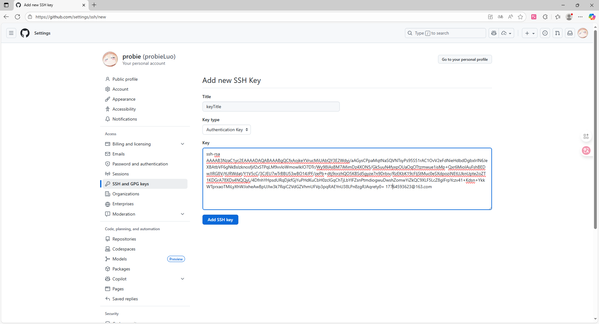

# Git Guide

## 什么是Git

>Git is a free and open source distributed version control system designed to handle everything from small to very large projects with speed and efficiency.

>Git is easy to learn and has a tiny footprint with lightning fast performance. It outclasses SCM tools like Subversion, CVS, Perforce, and ClearCase with features like cheap local branching, convenient staging areas, and multiple workflows.

Git是一个免费且开源的分布式版本控制系统，旨在以速度和效率处理从小型到大型项目的所有内容。  

Git易于学习，具有小巧的体积和闪电般的性能。它凭借诸如低成本本地分支、方便的暂存区域和多种工作流程等特性，超越了Subversion、CVS、Perforce和ClearCase等SCM工具。

那么问题来了，什么是版本控制系统？  

版本控制系统（Version Control System，简称 VCS）是一种用于记录文件内容变化、以便将来查阅特定版本修订情况的软件工具。它可以让多人协作开发同一个项目，跟踪每一次的更改，随时恢复到历史状态，比较不同版本的差异，并有效防止数据丢失。


## 1.安装配置

Git下载地址： [git-scm.com/downloads](https://git-scm.com/downloads)

下载完成后直接安装，一直点下一步即可。

打开GitBushs，配置个人的用户名称和email，这是为了在每次提交代码时记录提交者的信息：
```
git config --global user.name "your name"
git config --global user.email "your email"
```

检查config
```
$ git config --global user.name
> your name
$ git config --global user.email
> your email
```

上面是设置全局的config，为单个仓库设置只需把 `global` 去掉
```
git config user.name "your name"
git config user.email "your email"
```

检查单个仓库config
```
$ git config user.name
> your name
$ git config user.email
> your email
```

检查配置信息：
```
git config --list
```

### 1.1.关联GitHub

生成SSH密钥，输入下列命令回车生成公钥，在C:\Users\Administrator下面会有一个.ssh文件夹。
```
ssh-keygen -t rsa -C "your email"
```
登录GitHub，头像=>Settings=>SHH and GPC keys=>New SSH key，把.ssh文件夹下面id_rsa.pub打开复制粘贴到key，Title随便填即可。



测试关联GitHub是否成功，输出 `Hi XXX! You've successfully` 成功。
```
$ ssh -T git@github.com
> Hi probieLuo! You've successfully authenticated, but GitHub does not provide shell access.
```

## 2.Git基本操作

| 命令                                      | 说明                                                         |
|-------------------------------------------|--------------------------------------------------------------|
| `git init`                               | 初始化仓库                                                   |
| `git add README.md`                      | 添加文件到暂存区                                             |
| `git add .`                              | 所有文件添加到暂存区                                         |
| `git commit -m "first commit"`           | 提交修改（将暂存区内容添加到仓库中）                         |
| `git branch -M master`                   | 强制重命名当前分支为 master                                  |
| `git remote add origin git@github.com:probieLuo/xxx.git` | 为当前 Git 仓库添加一个名为 origin 的远程仓库                |
| `git push -u origin master`              | 将本地 master 分支的代码推送到远程仓库 origin，并与其关联     |

### 2.1.Git更新代码

1. 配置远程仓库

        git remote add origin git@github.com:probieLuo/xxx.git

        #查看现有远程仓库
        git remote -v

2. 获取远程仓库信息

        git fetch origin

3. 检查分支状态

        git status

        #所有更改添加到暂存区
        git add .

        #提交更改
        git commit -m "remark"

4. 合并远程更改 

        git pull origin master

